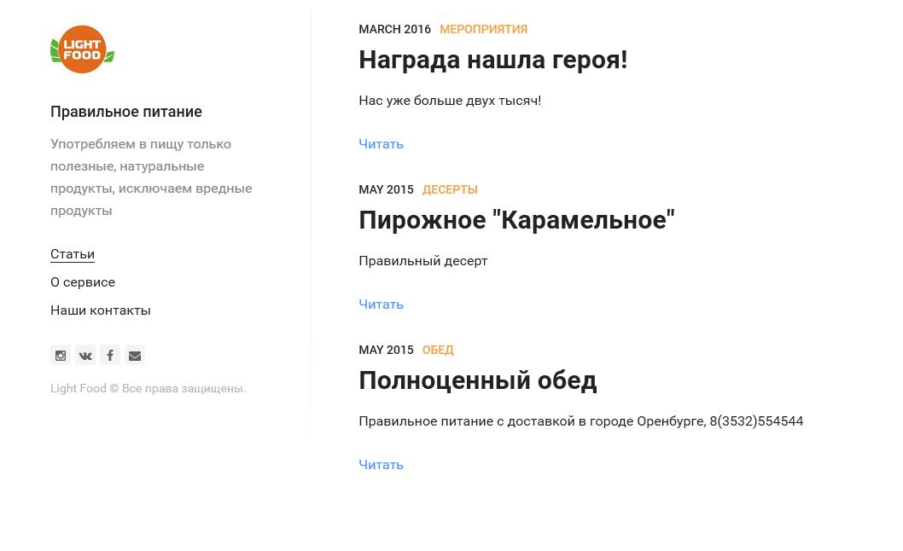

# Блог

Блог, для доставки еды в оренбурге

## Возможности
+ React
+ Inline CSS.
+ Clean and extensible code.
+ Six simple components: SiteSidebar, SiteNav, SiteLinks, SitePost, SitePage, ReadNext.
+ [peterramsing/lost](https://github.com/peterramsing/lost) as a base for Grid.
+ [matejlatin/Gutenberg](https://github.com/matejlatin/Gutenberg) as a base for Typography.

## Запуск и разработка
`gatsby develop`

## License
The MIT license.

Copyright (c) 2016 Stanislav Tsbetkov [tsvetkovpro](https://tsvetkovpro.github.io/)