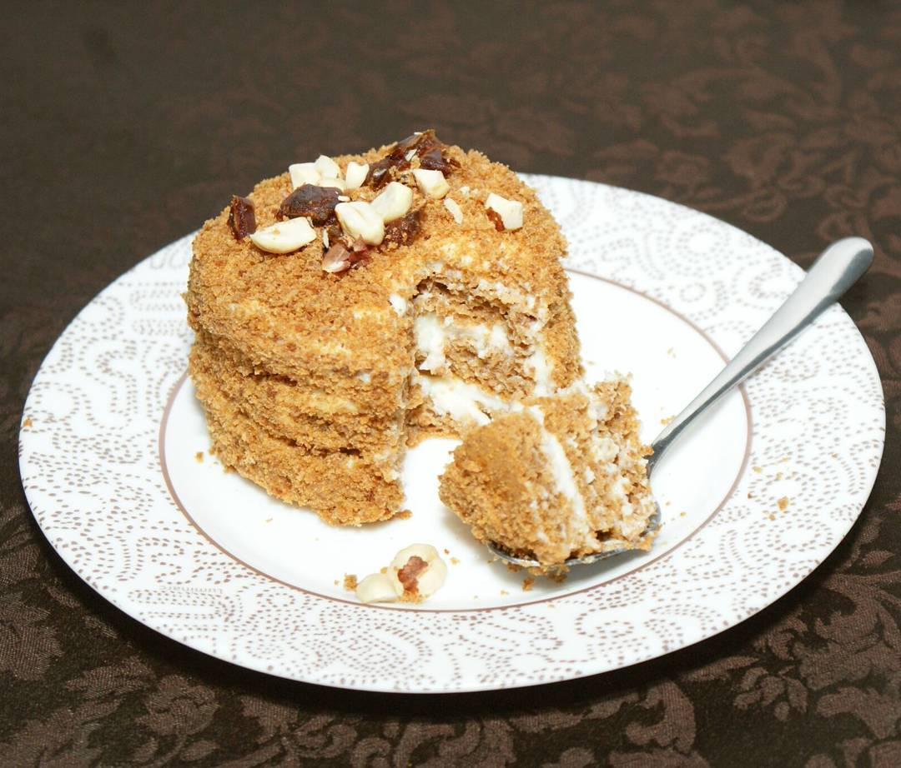

*Представляем пирожное "Карамельное"!*

Калории/белки/жиры/углеводы -  КБЖУ на 100 гр.: 145 ккал, белки - 10 гр., жиры - 4 гр, 16,5 гр - углеводы.

Для информации, калорийность аналогичного классического пирожного - 420 ккал.

<figure class="floatRight">
	
	<figcaption>пирожное "Карамельное"</figcaption>
</figure>